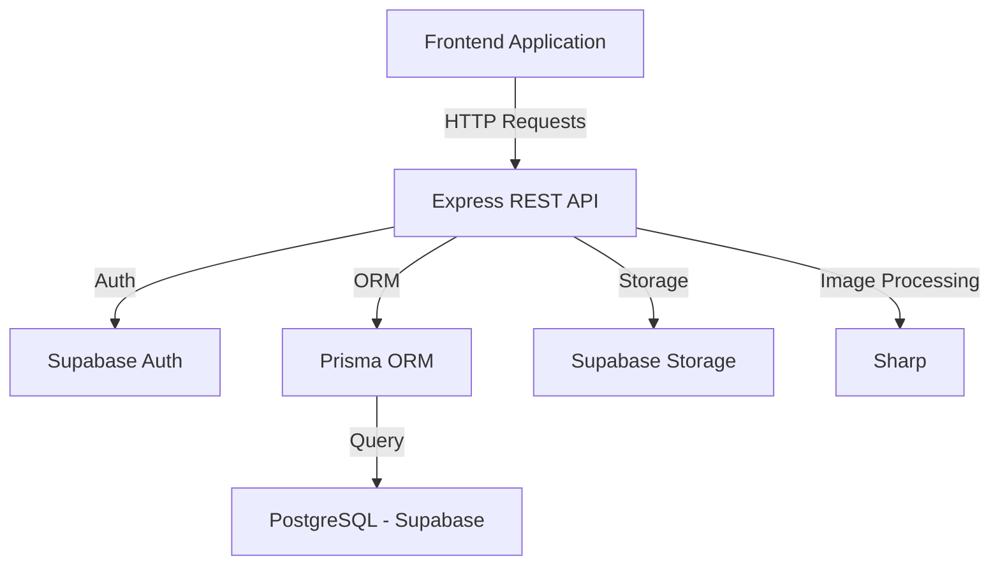

# 🏫 Shikshadeep Academy Backend

## 📦 Robust School Management System API

A comprehensive, production-ready REST API built using **Node.js**, **Express**, and **Supabase (PostgreSQL)**, powered by **Prisma ORM**. This backend manages everything from student admissions and faculty details to blogs and school galleries.

## 🎯 Project Goal
The primary goal of this project is to provide a centralized and efficient backend architecture for Shikshadeep Academy, enabling seamless management of school records, communication, and digital presence.

## 🚀 Features
- 🔐 **Secure Authentication**: User sign-up, sign-in, and profile management via Supabase Auth.
- 📝 **Blog Management**: Full CRUD for school blogs with category/tag support and image processing.
- 🖼️ **Gallery System**: Multi-image uploads and tag-based filtering for school events.
- 🎓 **Admissions**: Automated student application processing.
- 💼 **Career Portal**: Job vacancy postings and application management.
- 📢 **Notices & Notifications**: Real-time flash notices and notification system.
- 📧 **Communications**: Inquiry form processing and newsletter subscriptions.
- 📂 **Asset Management**: Image optimization using Sharp and cloud storage in Supabase.

## 🧠 Architecture Overview


## 📡 API Endpoints

### 🔐 Authentication (`/auth`)
| Method | Endpoint | Description | Example URL |
| :--- | :--- | :--- | :--- |
| POST | `/auth/signup` | Register a new user | `https://example.com/auth/signup` |
| POST | `/auth/signin` | Login existing user | `https://example.com/auth/signin` |
| POST | `/auth/logout` | Logout user | `https://example.com/auth/logout` |
| PUT | `/auth/update/:id` | Update user profile | `https://example.com/auth/update/user-uuid` |

### 📝 Blogs (`/blogs`)
| Method | Endpoint | Description | Example URL |
| :--- | :--- | :--- | :--- |
| GET | `/blogs` | Get all blogs | `https://example.com/blogs?page=1&limit=10` |
| GET | `/blogs/:id` | Get single blog by ID | `https://example.com/blogs/blog-uuid` |
| GET | `/blogs/tag` | Get all blog tags | `https://example.com/blogs/tag` |
| GET | `/blogs/tag/:tag` | Get blogs by tag | `https://example.com/blogs/tag/science` |
| GET | `/blogs/search` | Search blogs | `https://example.com/blogs/search?q=admission` |
| POST | `/blogs/blog_post` | Create a blog post | `https://example.com/blogs/blog_post` |
| PUT | `/blogs/blog_update/:id` | Update a blog post | `https://example.com/blogs/blog_update/blog-uuid` |
| DELETE | `/blogs/blog_delete/:id` | Delete a blog post | `https://example.com/blogs/blog_delete/blog-uuid` |

### 🖼️ Gallery (`/gallery`)
| Method | Endpoint | Description | Example URL |
| :--- | :--- | :--- | :--- |
| GET | `/gallery` | Get all gallery posts | `https://example.com/gallery` |
| GET | `/gallery/post/:id` | Get single post | `https://example.com/gallery/post/post-uuid` |
| GET | `/gallery/images` | Get all images | `https://example.com/gallery/images` |
| GET | `/gallery/tags` | Get gallery tags | `https://example.com/gallery/tags` |
| GET | `/gallery/posts/tag` | Filter posts by tag | `https://example.com/gallery/posts/tag?tag=sports` |
| POST | `/gallery/post` | Upload images | `https://example.com/gallery/post` |
| DELETE | `/gallery/post_delete/:id`| Delete gallery post | `https://example.com/gallery/post_delete/post-uuid` |

### 🏫 School Data (`/school`)
| Method | Endpoint | Description | Example URL |
| :--- | :--- | :--- | :--- |
| GET | `/school` | Get school details | `https://example.com/school` |
| GET | `/school/advisory` | Get advisory council | `https://example.com/school/advisory` |
| GET | `/school/teachers` | Get faculty members | `https://example.com/school/teachers` |
| GET | `/school/flash-notice`| Get flash notices | `https://example.com/school/flash-notice` |
| GET | `/school/notice-board` | Get notice board | `https://example.com/school/notice-board` |
| GET | `/school/jobs` | Get job vacancies | `https://example.com/school/jobs` |
| POST | `/school/job/apply/:id`| Apply for a job | `https://example.com/school/job/apply/job-uuid` |

### 🎓 Admissions (`/admission`)
| Method | Endpoint | Description | Example URL |
| :--- | :--- | :--- | :--- |
| POST | `/admission/new` | Submit application | `https://example.com/admission/new` |
| GET | `/admission/applications`| List applications | `https://example.com/admission/applications` |
| GET | `/admission/application/:id`| View application | `https://example.com/admission/application/app-uuid` |
| DELETE | `/admission/remove/:id`| Delete application | `https://example.com/admission/remove/app-uuid` |

### 📢 Notifications (`/notification`)
| Method | Endpoint | Description | Example URL |
| :--- | :--- | :--- | :--- |
| GET | `/notification` | Get all notifications| `https://example.com/notification` |
| GET | `/notification/:id` | Get single notification| `https://example.com/notification/notif-uuid` |
| PUT | `/notification/update/:id`| Update notification | `https://example.com/notification/update/notif-uuid` |
| DELETE| `/notification/delete/:id`| Delete notification | `https://example.com/notification/delete/notif-uuid` |
| DELETE| `/notification/clear` | Clear all | `https://example.com/notification/clear` |

### 📧 Inquiries & Newsletters
| Method | Endpoint | Module | Description | Example URL |
| :--- | :--- | :--- | :--- | :--- |
| POST | `/query/post` | Inquiries | Submit a new query | `https://example.com/query/post` |
| GET | `/query` | Inquiries | List all queries | `https://example.com/query` |
| POST | `/subscriber/post` | Newsletter | Subscribe to email | `https://example.com/subscriber/post` |
| GET | `/subscriber` | Newsletter | List subscribers | `https://example.com/subscriber` |

## 🛠️ Tech Stack
- **Runtime**: Node.js
- **Framework**: Express.js
- **Database**: PostgreSQL (Supabase)
- **ORM**: Prisma
- **Storage**: Supabase Storage
- **Image Processing**: Sharp
- **Language**: JavaScript (ESM)

## ⚙️ Setup & Installation
```bash 
# Clone the repository
git clone https://github.com/phurpa/sikshadeep-backend.git

# Install dependencies
npm install

# Configure environment variables
cp .env.example .env # Create .env with your credentials

# Run development server
npm run dev
```

### Environment Variables (.env)
```env
SUPABASE_URL=your_supabase_project_url
SUPABASE_SERVICE_ROLE_KEY=your_supabase_key
DATABASE_URL=your_postgresql_connection_string
PORT=9000
```