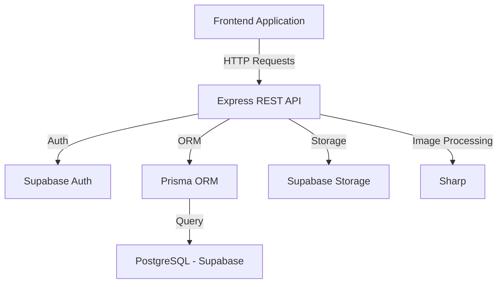

# 🏫 Shikshadeep Academy Backend

## 📦 Robust School Management System API

A comprehensive, production-ready REST API built using **Node.js**, **Express**, and **Supabase (PostgreSQL)**, powered by **Prisma ORM**. This backend manages everything from student admissions and faculty details to blogs and school galleries.

## 🎯 Project Goal
The primary goal of this project is to provide a centralized and efficient backend architecture for Shikshadeep Academy, enabling seamless management of school records, communication, and digital presence. It aims to bridge the gap between administrative operations and digital accessibility.

## 📌 Objectives
- **Centralized Data Management**: Provide a single source of truth for all school-related data, including students, faculty, and administrative records.
- **Operational Efficiency**: Automate routine tasks such as admission processing, job applications, and notification delivery.
- **Scalable Architecture**: Build a robust API that can easily expand to accommodate new features like student portals or advanced management modules.
- **Data Integrity & Security**: Ensure secure access to sensitive information through role-based authentication and secure database practices.
- **Optimized Asset Delivery**: Efficiently manage and serve high-quality media for school blogs and galleries.

## � Use Cases
- **School Administration**: Managing faculty profiles, posting job vacancies, and reviewing student admission applications through a secure dashboard.
- **Academic Content Creators**: Publishing blogs, news, and updates to keep the school community informed and engaged.
- **Prospective Students & Parents**: Submitting admission inquiries, applying for enrollment, and staying updated via flash notices and newsletters.
- **Job Seekers**: Viewing available vacancies and submitting digital applications directly through the school portal.
- **Event Organizers**: Managing the school gallery to showcase events, sports, and academic achievements.

## 🧠 Architecture Overview


## 🛠️ Tech Stack
- **Runtime**: Node.js
- **Framework**: Express.js
- **Database**: PostgreSQL (Supabase)
- **ORM**: Prisma
- **Storage**: Supabase Storage
- **Image Processing**: Sharp
- **Language**: JavaScript (ESM)

## ⚙️ Setup & Installation
```bash 
# Clone the repository
git clone https://github.com/phurpa/sikshadeep-backend.git

# Install dependencies
npm install

# Configure environment variables
cp .env.example .env # Create .env with your credentials

# Run development server
npm run dev
```

### Environment Variables (.env)
```env
SUPABASE_URL=your_supabase_project_url
SUPABASE_SERVICE_ROLE_KEY=your_supabase_key
DATABASE_URL=your_postgresql_connection_string
PORT=9000
```